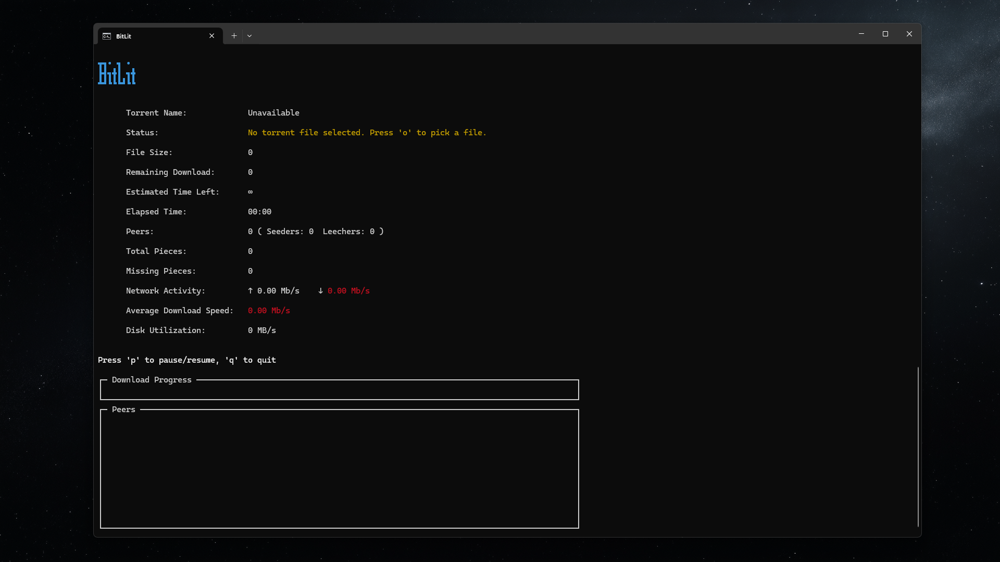
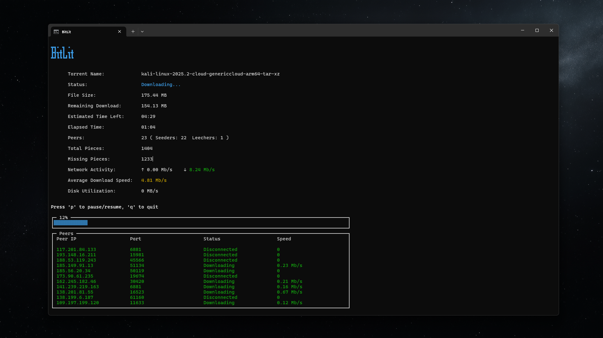
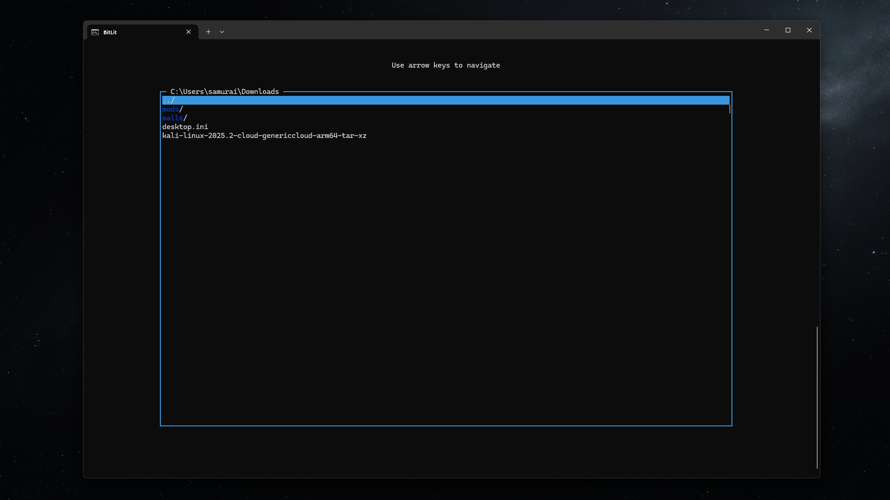
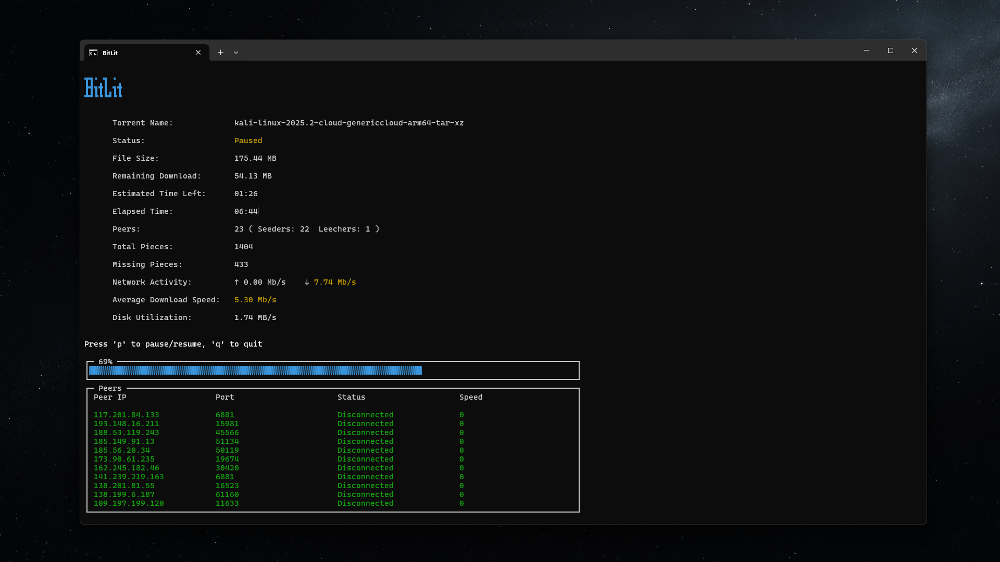

# BitLit - Terminal Torrent Client

A lightweight, terminal-based BitTorrent client built with Node.js. BitLit lets you download torrents right from your terminal with a fast and interactive UI.

[](https://www.npmjs.com/package/bitlit)
[](https://nodejs.org/)


### Demo

A quick look at BitLit running in the terminal:


### Interface

<p float="left">
  &nbsp;&nbsp;
  &nbsp;&nbsp;
  &nbsp;&nbsp;
  
</p>

## Features

- 📦 Download `.torrent` files via P2P
- ⬇️ Download progress tracking
- 📂 File manager
- 📊 Lightweight Terminal UI with live stats
- 🔁 Pause & Resume support
- 🧠 Endgame mode for faster completion
- 🧩 File type detection & renaming


## Installation

### npm
Install globally using npm:

```bash
npm install -g bitlit
```

Or use npx to run it directly:

```bash
npx bitlit
```

### Github
Clone the repository:
```bash
git clone https://github.com/crazysamurai/bitlit.git
cd bitlit
npm install
```

Install globally on your system:
```bash
npm install -g .
```

## Usage

### Basic Usage

```bash
bitlit path/to/your.torrent
```

### Interactive Mode

Run without arguments to launch the interactive file browser:

```bash
bitlit
```

### Keyboard Controls

- `↑`/`↓` - Navigate through files/folders
- `Enter` - Select file/folder
- `Esc` - Go back/Cancel
- `p` - Pause/Resume download
- `q` - Quit the application

## Requirements

- Node.js 14.x or higher
- npm or yarn
- Internet connection

## Dependencies

- `blessed` - Terminal interface library
- `blessed-contrib` - UI components
- `bencode` - Bencode encoding/decoding
- `file-type` - File type detection
- `node-disk-info` - Disk information

## Planned Features

- [ ] Seeding support
- [ ] Magnet URI support
- [ ] DHT support


## Contributing

This project was created as a personal learning exercise to better understand the BitTorrent protocol and networking. 
Contributions and feedback are welcome!

## License

[ISC](./LICENSE) © [CrazySamurai](https://github.com/crazysamurai)

## Acknowledgements

- Built with Node.js
- Uses the BitTorrent protocol
- Inspired by various open-source torrent clients
- Inspired by [How to Make Your Own BitTorrent Client](https://allenkim67.github.io/programming/2016/05/04/how-to-make-your-own-bittorrent-client.html)
